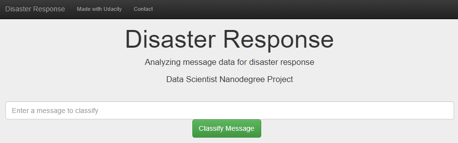
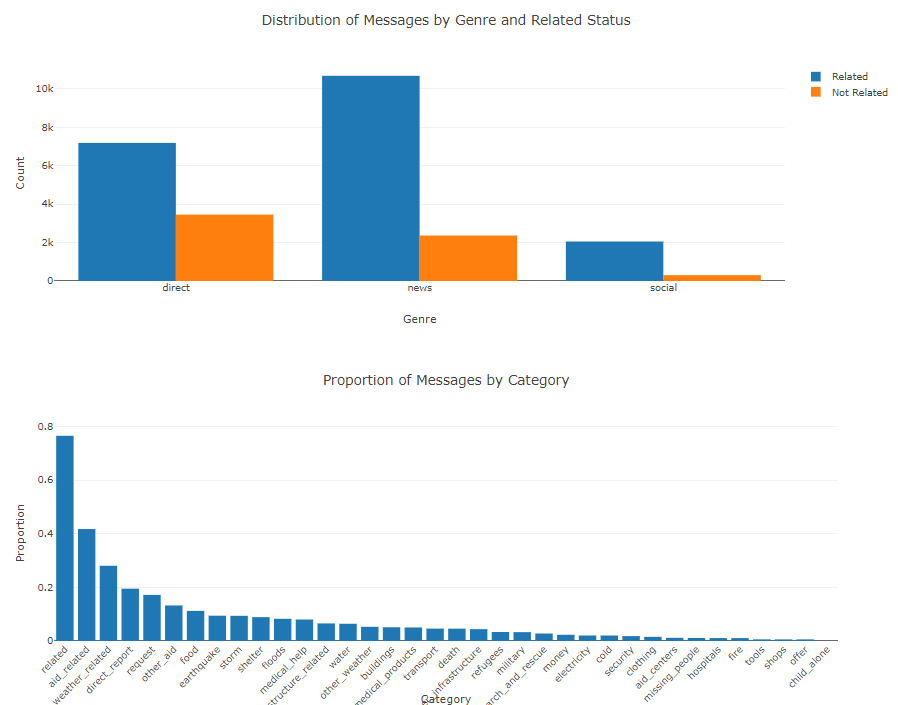
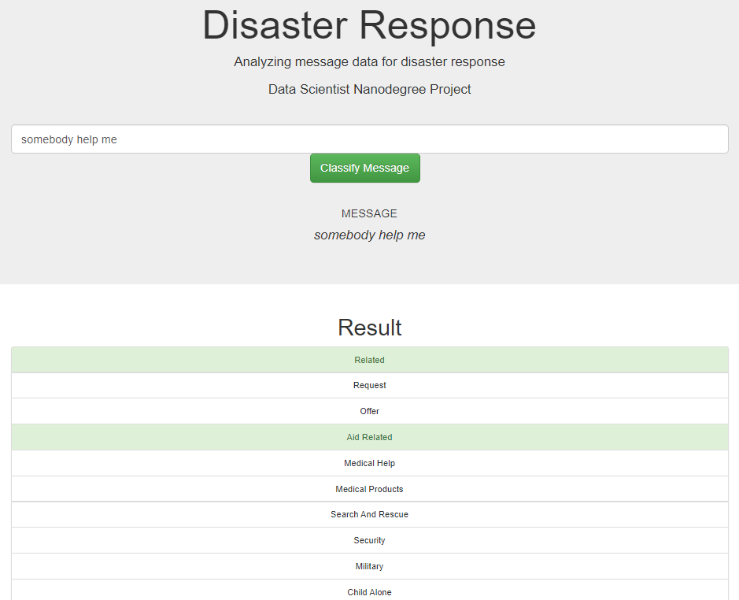

# Disaster-Response-Pipeline-Project

result

Udacity Data Scientist Nanodegree 2nd Term Project in Udacity

* 2020.05.05
* https://github.com/NamWoo

## Introduction

**Analyzing message data for disaster response.**

### Libraries
* python 3.69
* pandas
* numpy
* flask
* pickle
* re
* nltk
* sklearn 22.1
  * `pip3 install scikit-learn==22.1`
* nltk
* sqlalchemy
* plotly

### Data

* Disaster messages and categories
   * disaster_categories.csv
   * disaster_messages.csv

## How to start?

1. Run the following commands in the project's root directory to set up your database and model.

    - If you need, To run setup python library 
      * `sh ./setup.sh`
    - To run ETL pipeline that cleans data and stores in database
        * `python data/process_data.py data/disaster_messages.csv data/disaster_categories.csv data/DisasterResponse.db`
    - To run ML pipeline that trains classifier and saves
        * `python models/train_classifier.py data/DisasterResponse.db models/classifier.pkl`

2. Run the following command in the app's directory to run your web app.
   * `python run.py`

3. Go to http://0.0.0.0:3001/ or http://localhost:3001/

## Reference & Resource
* [Udacity](https://www.udacity.com/), Data Scientist Nanodegree 2nd.

